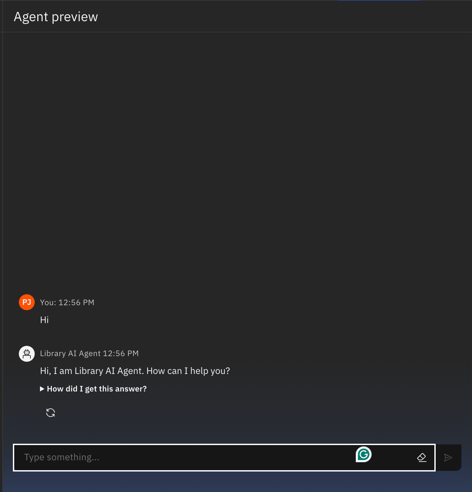

# 📚 Library AI Agent


> An intelligent AI agent built on **IBM Granite** and **IBM Cloud** that helps students find the right learning materials by understanding natural language queries, analysing study profiles, and providing personalised book recommendations with real-time availability checks.

---

## 📌 Problem Statement

Students often struggle to efficiently find relevant books and resources from a library database — especially when syllabi are dense and time is limited. Traditional keyword-based library search systems fail to understand academic context or personalise recommendations.

This project addresses that gap by building a conversational **Library AI Agent** that understands student queries in natural language, maps them to the most relevant resources, and assists with availability and reservations — all autonomously.

---

## 🎯 Objective

- Build a conversational AI agent that assists students in finding library resources
- Use **IBM Granite LLM** (via IBM Cloud) for natural language understanding and response generation
- Enable the agent to handle academic queries, book recommendations, and availability checks
- Deploy the agent on **IBM Cloud** and demonstrate real-world usability with sample interactions

---

## 🧠 How It Works

```
Student Query (Natural Language)
            │
            ▼
    IBM Granite LLM
    (NLP Understanding)
            │
            ▼
  Intent Classification
  ┌──────────────────────────────┐
  │  Book Search                 │
  │  Availability Check          │
  │  Personalised Recommendation │
  │  Reservation / Waitlist      │
  └──────────────────────────────┘
            │
            ▼
  Library Database Matching
            │
            ▼
  Contextual Response to Student
```

---

## ✨ Features

- **Natural Language Understanding** — Students can ask questions in plain English; the agent interprets intent and context
- **Personalised Recommendations** — Matches books to the student's academic profile, course syllabus, and study topics
- **Real-Time Availability** — Checks current book availability and prioritises high-demand titles
- **Reservation Assistance** — Helps students reserve books or join a waitlist when unavailable
- **Deployed on IBM Cloud** — Fully deployed and accessible via IBM Watson deployment infrastructure

---

## 🖼️ Screenshots

| Home Page | Greeting | Sample Interactions |
|---|---|---|
|  |  |  |

> Additional sample interactions available in `Sample Question 2.png`, `Sample Question 3.png`, `Sample Question 4.png`.

---

## 🛠️ Tech Stack

| Tool / Platform | Purpose |
|---|---|
| IBM Granite LLM | Core language model for NLP and response generation |
| IBM Cloud (Lite) | Hosting and deployment infrastructure |
| IBM Watson AI | Agent orchestration and API services |
| Python | Agent logic and notebook workflows |
| Jupyter Notebook | Development and deployment notebooks |

---

## 📂 Project Structure

```
📦 Library-AI-Agent
 ┣ 📓 notebook:LibraryAIAgentStandardNotebook-...ipynb    # Agent development notebook
 ┣ 📓 notebook:LibraryAIAgentDeploymentNotebook-...ipynb  # Deployment configuration notebook
 ┣ 📄 Python.txt                                           # Python dependencies / environment setup
 ┣ 🖼️ Home Page.png                                        # Agent home page screenshot
 ┣ 🖼️ Greeting.png                                         # Agent greeting screenshot
 ┣ 🖼️ Deployment.png                                       # IBM Cloud deployment screenshot
 ┣ 🖼️ Sample Question 1.png                                # Sample interaction 1
 ┣ 🖼️ Sample Question 2.png                                # Sample interaction 2
 ┣ 🖼️ Sample Question 3.png                                # Sample interaction 3
 ┣ 🖼️ Sample Question 4.png                                # Sample interaction 4
 ┗ 📄 README.md                                            # Project documentation
```

---

## 🚀 Getting Started

### Prerequisites

- An **IBM Cloud** account (Lite plan supported)
- Access to **IBM Watson** services and **IBM Granite** model
- Python 3.8+ with dependencies from `Python.txt`

### Setup

```bash
# Clone the repository
git clone https://github.com/PJ2001-IND/Library-AI-Agent.git

# Navigate to the project directory
cd Library-AI-Agent

# Install dependencies
pip install -r Python.txt
```

### Running the Agent

1. Open `LibraryAIAgentStandardNotebook` in IBM Watson Studio or Jupyter
2. Configure your IBM Cloud API credentials
3. Run all cells to initialise the agent
4. For deployment, open `LibraryAIAgentDeploymentNotebook` and follow the deployment steps

---

## 💡 Key Insights

- IBM Granite LLM handles ambiguous academic queries significantly better than keyword search systems
- Personalisation based on course topics dramatically reduces the number of irrelevant recommendations
- Deploying on IBM Cloud enables scalable, institution-wide access without local infrastructure

---

## 🔭 Future Scope

- Integrate with real library management systems (e.g. Koha, OpenBiblio)
- Add multi-language support for regional universities
- Build a web UI using Streamlit or React for a friendlier student-facing interface
- Extend the agent to handle digital resource recommendations (PDFs, research papers, MOOCs)

---

## 👤 Author

**Praasuk Jain**
- GitHub: [@PJ2001-IND](https://github.com/PJ2001-IND)
- LinkedIn: [praasuk-jain](https://www.linkedin.com/in/praasuk-jain-425b6b1a3/)

---

## 📄 License

This project is licensed under the MIT License.

---

> ⭐ If you found this project useful, consider giving it a star!
